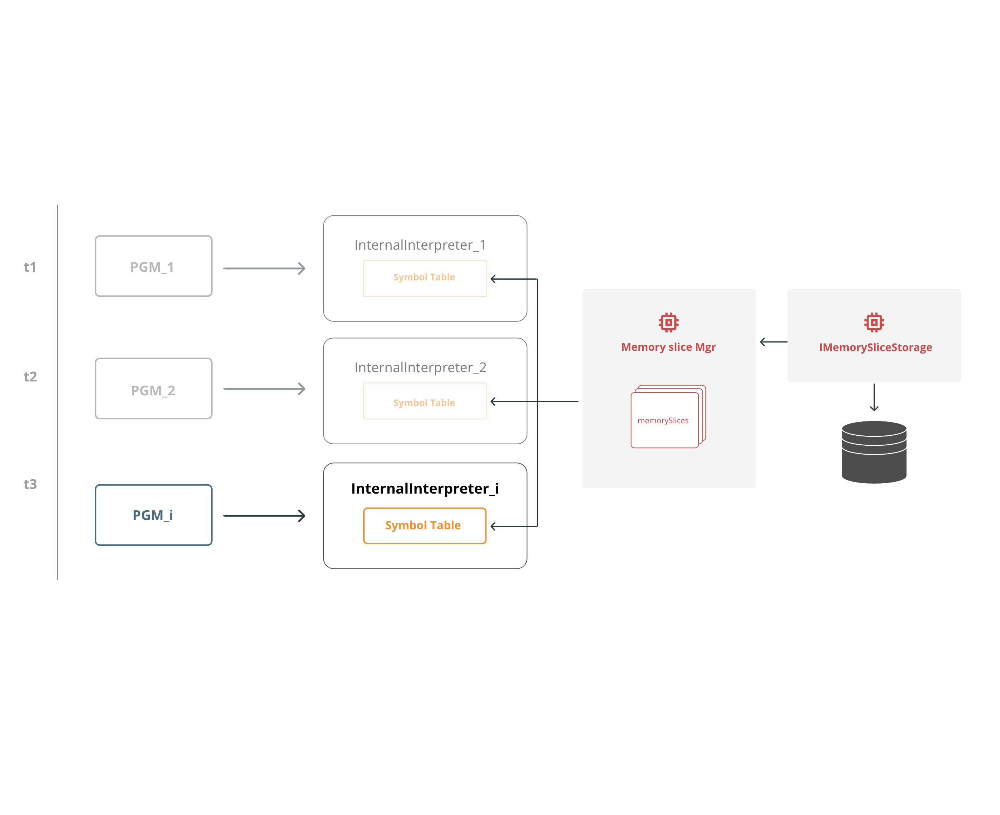
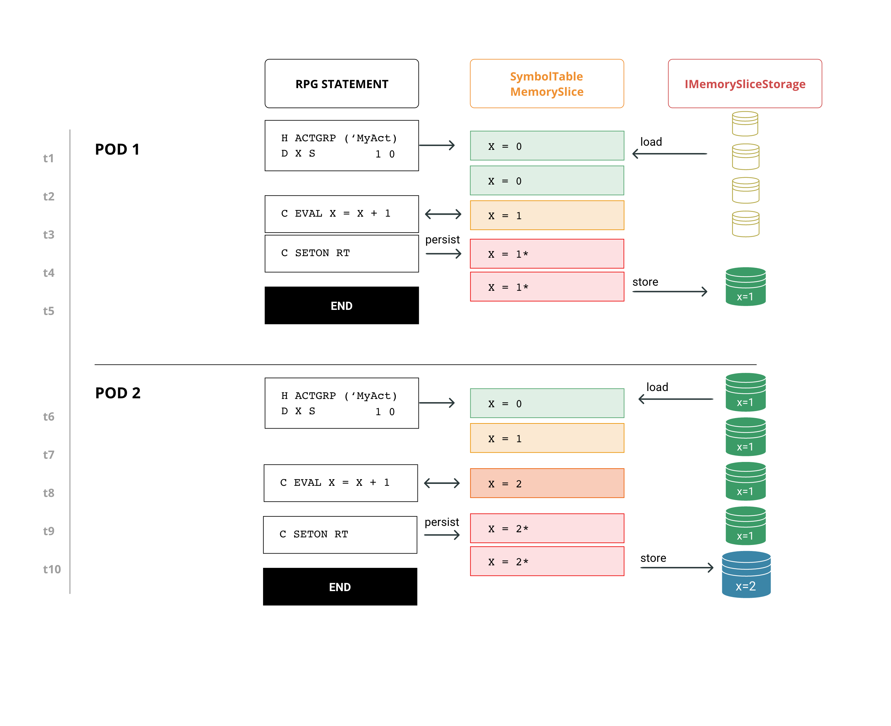

# Abstract
In this document we are going to present how Jariko allows managing programs memory persistence using as approach the serialization.  
As everyone knows the symbol table is an object containing the program memory, and generally speaking
it is nothing more than a `Map<String, Value>` with String: the variable name, and Value: the value of it.  
Symbol table has scope program and lives within the program, but when
the program dies, if that program runs into an activation group, we need to recover its state, for this reason we have thought 
about serialization.

# Serialization model
The following chart shows the objects involved with particular relevance to what happens over the time.  
We suppose that Jariko will be run three different programs in the same thread.  
The almost hidden objects (gray) are *not alive*, the others are *alive*, but all objects have lived (or are living)
in the same instance of Jariko.

## InternalInterpreter
For each interpreted PGM we have an instance of InternalInterpreter having its own instance of SymbolTable.  
You can think about the follow calls stack: PGM1 -> PGM2 -> PGMi and as you can guess, PGMi is the current execution program.  

## MemorySlice
This object tell us that the SymbolTable and its own persistence are different things. The MemorySlice is nothing 
of more complex than an association between the SymbolTable instance and the MemorySliceId.  
MemorySliceId is identified just by following properties:
 * Program
 * Activation group  

In conclusion, we can say that we will have an instance of MemorySlice for each SymbolTable.

## MemorySliceMgr
This object, behind the scenes, handles serialization and de-serialization mechanisms.

### Deserialization
For each SymbolTable belonging to a program running within an activation group, the initialization phase includes:
 * The creation of MemorySlice in which we couple SymbolTable with MemorySliceId
 * The reading from IMemorySliceStorage and retrieving of `Map<String, Value>` containing stored values associated to MemorySliceId
 * The SymbolTable initialization using `Map<String, Value>` returned by the previous step

### Serialization
The serialization is triggered only at the end of the main program execution.  
For each MemorySlice having property `persist=true` (program running into activation group), MemorySlice will be passed to
IMemorySliceStorage and it will be stored. 

### IMemorySliceStorage
This interface should be implemented to accomplish the SymbolTable serialization and deserialization.

### SymbolTable and IMemoryStorage state over time
In this figure we will highlight the state transitions of main objects involved in the serialization during the interpretation of the RPG.  
Different colors stand for state transactions.  
Time sequence represents an hypothetical case for which the same RPG program will be interpreted sooner in POD1 and later in POD2, POD1 and POD2 host two different Jariko instances and are totally isolated one for each other.  

* t1 - Variable X initialization and MemorySlice creation
* t2 - Loading by IMemorySliceStorage of that memory related to MemorySliceId. 
  It being the storage empty, the default INZ value will be preserved
* t3 - Increasing of X and memorization into SymbolTable
* t4 - Notification to the MemorySlice that the associated SymbolTable will need to be serialized
* t5 - At the main program exiting, SymbolTable will be serialized into the storage
* t6 - Variable X initialization and MemorySlice creation
* t7 - Loading by IMemorySliceStorage of that memory related to MemorySliceId.
  The storage contains variable X and its own value 1 will be used to initialize the SymbolTable
* t8 - Increasing of X from 1 to 2 e storing of the current value into SymbolTable
* t9 - Notification to the MemorySlice that the associated SymbolTable will need to be serialized
* t10 - At the main program exiting, SymbolTable will be serialized into the storage
